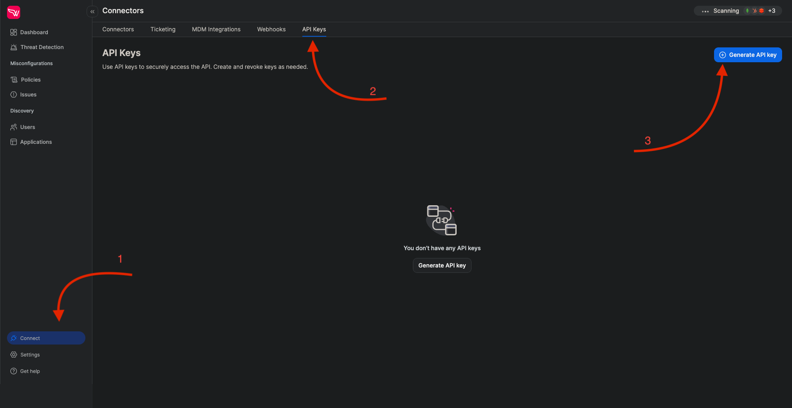
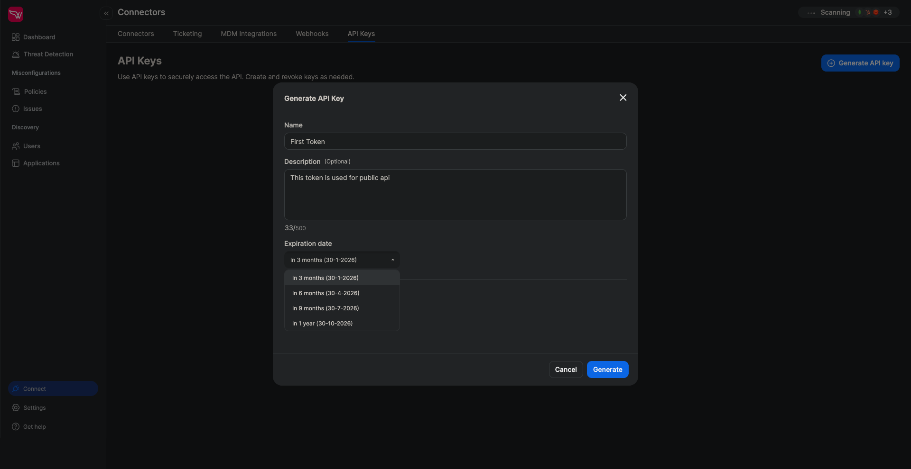
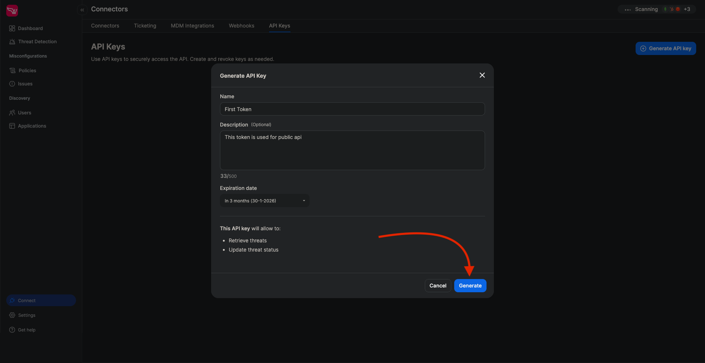
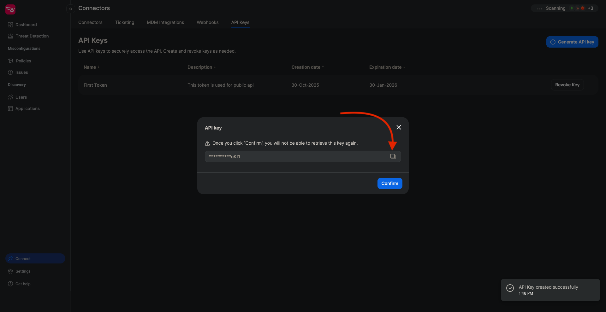
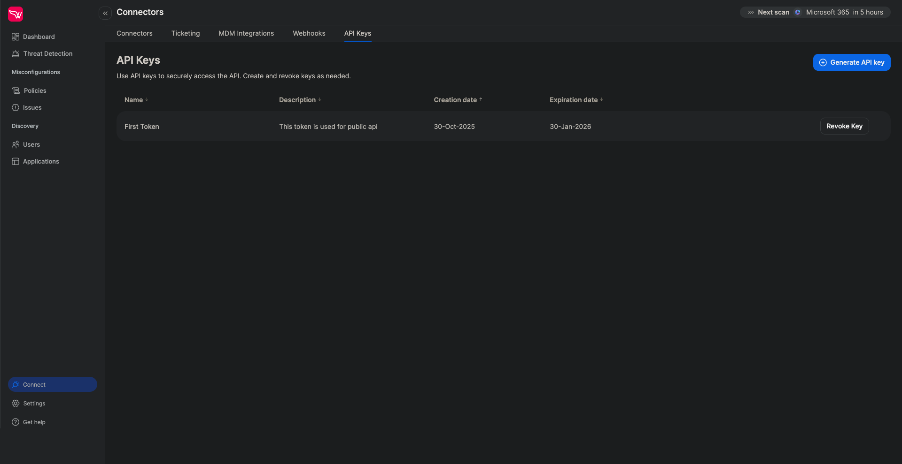
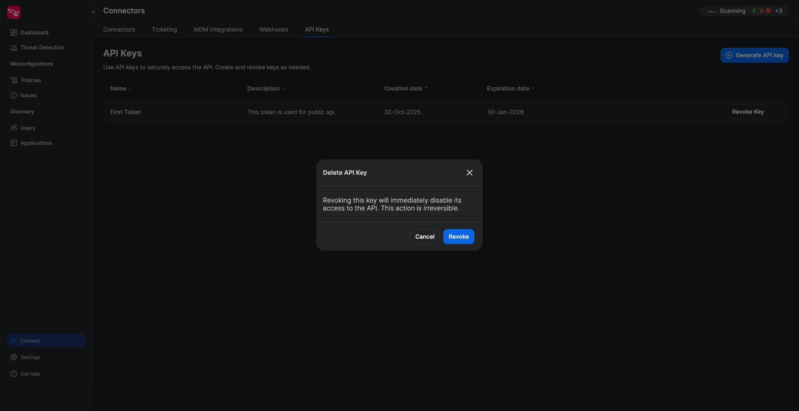

# Wing Public API Documentation

## Overview

The Wing Public API provides endpoints for retrieving user and application inventory data. All endpoints require authentication and are designed for external integrations and programmatic access.

**Base URL**: `https://public-api.wing.security`

## Authentication

To access the Wing Public API, you must first create an API key through the Wing portal. All API requests require authentication using a Bearer token in the Authorization header.

### Creating an API Key

#### Step 1: Navigate to API Keys

- Log in to the Wing portal
- Navigate to the **Connect** section
- Locate and click on **API Keys**



#### Step 2: Generate a New API Key

1. Click **Generate API Key** to create a new key
2. Enter a descriptive name for your API key
3. Optionally add a meaningful description to help identify the key's purpose
4. Select an appropriate expiration date from the available options
5. Click **Generate** to create the key




#### Step 3: Copy Your API Key

After generation, you'll see a popup window displaying your API key. For security reasons:

- The complete key is only shown once
- The key is not stored in our system after confirmation
- You cannot retrieve the key again after closing this window

**Important**: Copy your API key immediately using the **Copy** button before clicking **Confirm**.



#### Step 4: Manage Your API Keys

Your newly created API key will appear in the list of available API keys. You can view all your active keys and their details from this interface.



#### Step 5: Revoke API Keys

To revoke an API key:

1. Locate the key you want to revoke in the API keys list
2. Click the **Revoke** button
3. Confirm the revocation in the popup dialog

**Warning**: Once revoked, the API key will immediately become invalid and cannot be restored.



### Using Your API Key

Include your API key in all requests using the Authorization header:

```bash
curl -X GET "https://api.wing.security/v1/users" \
  -H "Authorization: Bearer YOUR_API_KEY_HERE"
```

**Security Best Practices:**
- Store your API key securely and never commit it to version control
- Use environment variables or secure credential management systems
- Regularly rotate your API keys
- Revoke unused or compromised keys immediately

---

## API Endpoints

| Method | Endpoint | Description |
|--------|----------|-------------|
| GET | `/v1/users` | Retrieve users with filters and pagination |
| GET | `/v1/apps` | Retrieve applications with filters and pagination |

---

## Endpoints Reference

### Get Users

```
GET /v1/users
```

Retrieve a filtered and paginated list of users with their organizational details and security status.

#### Request Parameters

| Parameter | Type | Required | Description |
|-----------|------|----------|-------------|
| `org_unit` | string | No | Filter by organizational unit |
| `tags` | array[string] | No | Filter by user tags |
| `status` | string | No | Filter by user status (active, inactive, deleted, etc.) |
| `mfa_enabled_in` | array[string] | No | Filter users with MFA enabled in specific connectors |
| `mfa_disabled_in` | array[string] | No | Filter users with MFA disabled in specific connectors |
| `page` | integer | No | Page number (default: 0) |
| `page_size` | integer | No | Items per page (default: 50) |

#### Response Schema

```json
{
  "type": "object",
  "properties": {
    "users": {
      "type": "array",
      "items": {
        "type": "object",
        "properties": {
          "id": {
            "type": "string",
            "description": "Unique user identifier"
          },
          "name": {
            "type": "string",
            "description": "User's full name"
          },
          "status": {
            "type": "string",
            "enum": ["active", "inactive", "deleted", "deleted from api", "inconsistent"],
            "description": "Current user account status"
          },
          "hrStatus": {
            "type": "string",
            "description": "Employment status from HR system"
          },
          "jobTitle": {
            "type": "string",
            "description": "User's job title"
          },
          "reportsTo": {
            "type": "string",
            "description": "User ID of direct manager"
          },
          "organizationalUnit": {
            "type": "string",
            "description": "Organizational unit or department"
          },
          "idpMfaStatus": {
            "type": "array",
            "items": {
              "type": "object",
              "properties": {
                "connectorName": {
                  "type": "string",
                  "description": "Name of the identity provider connector"
                },
                "status": {
                  "type": "string",
                  "enum": ["Enabled", "Disabled", "Unknown"],
                  "description": "MFA status for this connector"
                }
              },
              "required": ["connectorName", "status"]
            },
            "description": "MFA status per identity provider"
          },
          "adminIn": {
            "type": "array",
            "items": {
              "type": "string"
            },
            "description": "List of connectors where user has admin privileges"
          },
          "tags": {
            "type": "array",
            "items": {
              "type": "string"
            },
            "description": "User tags"
          },
          "applicationsCount": {
            "type": "integer",
            "description": "Total number of applications user has access to"
          }
        },
        "required": ["id"]
      }
    },
    "pagination": {
      "type": "object",
      "properties": {
        "page": {
          "type": "integer",
          "description": "Current page number (zero-indexed)"
        },
        "pageSize": {
          "type": "integer",
          "description": "Number of items per page"
        },
        "total": {
          "type": "integer",
          "description": "Total number of items across all pages"
        }
      },
      "required": ["page", "pageSize", "total"]
    }
  },
  "required": ["users", "pagination"]
}
```

#### Response Status Codes

| Status Code | Description |
|-------------|-------------|
| 200 | Success |
| 400 | Bad Request - Invalid parameters |
| 401 | Unauthorized - Missing or invalid authentication |
| 403 | Forbidden - Insufficient permissions |
| 429 | Too Many Requests - Rate limit exceeded |
| 500 | Internal Server Error |

#### User Status Values

- `active` - User is currently active
- `inactive` - User account is inactive
- `deleted from api` - User was deleted from the source system
- `deleted` - User account has been deleted
- `inconsistent` - User data is in an inconsistent state

#### MFA Status Values

- `Enabled` - Multi-factor authentication is enabled
- `Disabled` - Multi-factor authentication is disabled
- `Unknown` - MFA status cannot be determined

#### Example Request

```bash
curl -X GET "https://public-api.wing.security/v1/users?status=active&page=0&page_size=50" \
  -H "Authorization: Bearer YOUR_API_TOKEN"
```

#### Example Response

```json
{
  "users": [
    {
      "id": "usr_abc123",
      "name": "John Doe",
      "status": "active",
      "hrStatus": "employed",
      "jobTitle": "Senior Engineer",
      "reportsTo": "usr_mgr456",
      "organizationalUnit": "Engineering",
      "idpMfaStatus": [
        {
          "connectorName": "okta",
          "status": "Enabled"
        },
        {
          "connectorName": "google",
          "status": "Disabled"
        }
      ],
      "adminIn": ["slack", "github"],
      "tags": ["engineering", "full-time"],
      "applicationsCount": 42
    },
    {
      "id": "usr_def789",
      "name": "Jane Smith",
      "status": "active",
      "hrStatus": "employed",
      "jobTitle": "Product Manager",
      "reportsTo": "usr_dir321",
      "organizationalUnit": "Product",
      "idpMfaStatus": [
        {
          "connectorName": "okta",
          "status": "Enabled"
        }
      ],
      "adminIn": [],
      "tags": ["product", "full-time"],
      "applicationsCount": 28
    }
  ],
  "pagination": {
    "page": 0,
    "pageSize": 50,
    "total": 156
  }
}
```

---

### Get Apps

```
GET /v1/apps
```

Retrieve a filtered and paginated list of applications discovered in your organization.

#### Request Parameters

| Parameter | Type | Required | Description |
|-----------|------|----------|-------------|
| `classification` | string | No | Filter by app classification (Unclassified, Authorized, Internal, Forbidden) |
| `tags` | array[string] | No | Filter by application tags |
| `first_seen` | string (date-time) | No | Filter apps discovered after this date (ISO 8601 format) |
| `last_seen` | string (date-time) | No | Filter apps last seen before this date (ISO 8601 format) |
| `connectors` | array[string] | No | Filter by connector names where app was discovered |
| `page` | integer | No | Page number (default: 0) |
| `page_size` | integer | No | Items per page (default: 50) |

#### Response Schema

```json
{
  "type": "object",
  "properties": {
    "apps": {
      "type": "array",
      "items": {
        "type": "object",
        "properties": {
          "id": {
            "type": "string",
            "description": "Unique application identifier"
          },
          "name": {
            "type": "string",
            "description": "Application name"
          },
          "categories": {
            "type": "string",
            "description": "Comma-separated list of application categories"
          },
          "compliances": {
            "type": "array",
            "items": {
              "type": "string"
            },
            "description": "List of compliance standards (e.g., SOC2, GDPR, ISO27001)"
          },
          "usersCount": {
            "type": "integer",
            "description": "Number of users with access to this application"
          },
          "firstSeen": {
            "type": "string",
            "format": "date-time",
            "description": "Timestamp when application was first discovered"
          },
          "lastSeen": {
            "type": "string",
            "format": "date-time",
            "description": "Timestamp when application was last seen"
          },
          "intelEventsCount": {
            "type": "integer",
            "description": "Number of intelligence/security events associated with this app"
          },
          "aiStatus": {
            "type": "string",
            "description": "AI capability status (e.g., AI, AI Integrated, None)"
          },
          "classification": {
            "type": "string",
            "enum": ["Unclassified", "Authorized", "Internal", "Forbidden"],
            "description": "Application classification status"
          },
          "foundInConnectors": {
            "type": "array",
            "items": {
              "type": "object",
              "properties": {
                "connector": {
                  "type": "string",
                  "description": "Connector name where app was discovered"
                },
                "permissions": {
                  "type": "array",
                  "items": {
                    "type": "string"
                  },
                  "description": "List of permissions/scopes granted"
                }
              },
              "required": ["connector", "permissions"]
            },
            "description": "Connectors where this application was discovered"
          },
          "tags": {
            "type": "array",
            "items": {
              "type": "string"
            },
            "description": "Application tags"
          }
        },
        "required": ["id"]
      }
    },
    "pagination": {
      "type": "object",
      "properties": {
        "page": {
          "type": "integer",
          "description": "Current page number (zero-indexed)"
        },
        "pageSize": {
          "type": "integer",
          "description": "Number of items per page"
        },
        "total": {
          "type": "integer",
          "description": "Total number of items across all pages"
        }
      },
      "required": ["page", "pageSize", "total"]
    }
  },
  "required": ["apps", "pagination"]
}
```

#### Response Status Codes

| Status Code | Description |
|-------------|-------------|
| 200 | Success |
| 400 | Bad Request - Invalid parameters |
| 401 | Unauthorized - Missing or invalid authentication |
| 403 | Forbidden - Insufficient permissions |
| 429 | Too Many Requests - Rate limit exceeded |
| 500 | Internal Server Error |

#### Classification Values

- `Unclassified` - Application has not been classified
- `Authorized` - Application is authorized for use
- `Internal` - Internal/proprietary application
- `Forbidden` - Application was classified as forbidden for use

#### Example Request

```bash
curl -X GET "https://public-api.wing.security/v1/apps?classification=Authorized&page=0&page_size=20" \
  -H "Authorization: Bearer YOUR_API_TOKEN"
```

#### Example Response

```json
{
  "apps": [
    {
      "id": "app_slack_001",
      "name": "Slack",
      "categories": "Communication, Collaboration",
      "compliances": ["SOC2", "GDPR", "ISO27001"],
      "usersCount": 156,
      "firstSeen": "2023-06-15T08:00:00Z",
      "lastSeen": "2024-01-20T16:30:00Z",
      "intelEventsCount": 0,
      "aiStatus": "AI Integrated",
      "classification": "Authorized",
      "foundInConnectors": [
        {
          "connector": "slack",
          "permissions": ["channels:read", "users:read", "chat:write"]
        }
      ],
      "tags": ["productivity", "approved"]
    },
    {
      "id": "app_github_001",
      "name": "GitHub",
      "categories": "Development, Version Control",
      "compliances": ["SOC2", "ISO27001"],
      "usersCount": 89,
      "firstSeen": "2023-03-10T12:00:00Z",
      "lastSeen": "2024-01-20T17:15:00Z",
      "intelEventsCount": 2,
      "aiStatus": "None",
      "classification": "Authorized",
      "foundInConnectors": [
        {
          "connector": "github",
          "permissions": ["repo", "admin:org", "read:user"]
        }
      ],
      "tags": ["development", "critical"]
    },
    {
      "id": "app_notion_001",
      "name": "Notion",
      "categories": "Productivity, Documentation",
      "compliances": ["SOC2"],
      "usersCount": 234,
      "firstSeen": "2023-08-22T14:20:00Z",
      "lastSeen": "2024-01-21T09:15:00Z",
      "intelEventsCount": 0,
      "aiStatus": "AI",
      "classification": "Authorized",
      "foundInConnectors": [
        {
          "connector": "google",
          "permissions": ["openid", "profile", "email"]
        },
        {
          "connector": "slack",
          "permissions": ["links:read", "links:write"]
        }
      ],
      "tags": ["documentation", "approved"]
    }
  ],
  "pagination": {
    "page": 0,
    "pageSize": 20,
    "total": 45
  }
}
```

---

## Error Responses

### Application Error Responses

Application-level errors returned by the Wing Public API follow this format:

```json
{
  "status": "ERROR_TYPE",
  "detail": "Human-readable error description"
}
```

**Common Application Error Types:**
- `BAD_REQUEST_ERROR` - Invalid request parameters
- `NOT_FOUND_ERROR` - Resource not found

**Example:**

```json
{
  "status": "BAD_REQUEST_ERROR",
  "detail": "Invalid page_size parameter: must be between 1 and 1000"
}
```

### Gateway Error Responses

Infrastructure-level errors returned by AWS API Gateway follow a different format:

```json
{
  "message": "Error description"
}
```

**Common Gateway Error Types:**

| Status Code | Error Type | Description |
|-------------|------------|-------------|
| 401 | Unauthorized | Missing or invalid authentication |
| 403 | Forbidden | Insufficient permissions or invalid API key |
| 413 | Request Too Large | Request payload exceeds size limit |
| 415 | Unsupported Media Type | Content-Type not supported |
| 429 | Too Many Requests | Rate limit exceeded |
| 504 | Gateway Timeout | Request timeout |

**Example:**

```json
{
  "message": "Missing Authentication Token"
}
```

---

## Rate Limiting

The Wing Public API implements throttling limits to ensure optimal performance and fair usage across all clients.

### Limits

- **Rate Limit**: 10,000 requests per second (RPS)
- **Burst Limit**: 5,000 concurrent requests

### How Rate Limiting Works

The API uses a **token bucket algorithm** where each request consumes one token:

1. **Steady-State Rate**: Tokens replenish at 10,000 per second
2. **Burst Capacity**: Allows temporary traffic spikes up to 5,000 concurrent requests
3. **Throttling Response**: When limits are exceeded, the API returns HTTP `429 Too Many Requests`

### Important Notes

- Limits apply to **all users collectively** by default
- Throttling is applied on a best-effort basis
- For higher limits or dedicated quotas, contact Wing Security Customer Success
